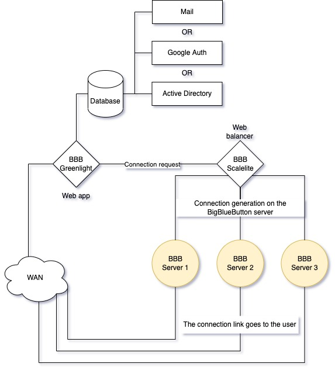

# BigBlueButton
------------
Role for installation and service of BigBlueButton, Scalelite balancer and GreenLight web application

This ansible role installs BigBlueButton v.2.4 on Ubuntu 18.04

# Scheme
------------

# Requirements
------------
- One server for Scalelite
- One server for GreenLight, with wild internet access
    For full access to the Internet, the following ports must be available:
    
    TCP = 443
- N-servers for BigBlueButton, assuming that one BBB with a minimum server configuration supports up to 200 people
    For full access to the Internet, the following ports must be available:
    
    TCP = 443, 80, 7443, 6556
    UDP = 16384:32768

# Used variables
------------
## For BigBlueButton

>`ssl_certificate` path to the private part of the certificate (with the name of the certificate)

>`ssl_certificate_key` path to the public part of the certificate (with the name of the certificate)

## For Greenlight
>`ssl_certificate` path to the private part of the certificate (with the name of the certificate)

>`ssl_certificate_key` path to the public part of the certificate (with the name of the certificate)

>`site` home address will reach the site

>`greenlight_help_url` Link to the ambulance channel

>`greenlight_secret_key` key to connect to greenlight (openssl rand -hex 64)

>`scalelite_secret_key` API connection key

>`scalelite_loadbalancer_key` key to connect to the balancer (openssl rand -hex 32)

### To connect to LDAP

>`greenlight_ldap_server` LDAP server network address

>`greenlight_ldap_port` LDAP server connection port

>`greenlight_ldap_base` Path to the OU where users are searched

>`greenlight_ldap_bind_dn` Path to the user that is used to connect to LDAP

>`greenlight_ldap_bind_pwd` User password used to connect to LDAP

## For Scalelite
>`ssl_certificate` path to the private part of the certificate (with the name of the certificate)

>`ssl_certificate_key` path to the public part of the certificate (with the name of the certificate)

>`scalelite_secret_key` API connection key

>`scalelite_loadbalancer_key` key to connect to the balancer (openssl rand -hex 32)

### In the role of bigbluebutton, greenlight and scalelite, in the "certficate.yml" task, you must specify the public and private parts of the certificate

# Information about the author
------------
Mikoshi Aleksandr - REAL ESTATE ECOSYSTEM "SQUARE METER" LIMITED LIABILITY COMPANY

# License
------------
Massachusetts Institute of Technology, MIT